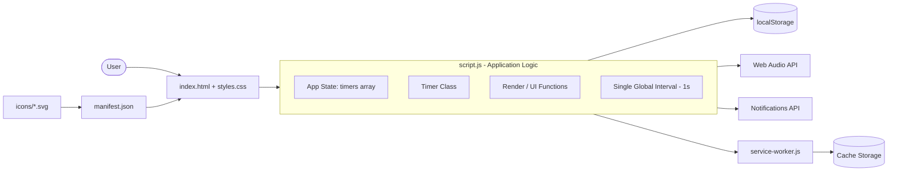

# Countdown Timer — Step-by-Step Build Guide

> **Archived: original build playbook.** This document is the original roadmap used to build the Countdown Timer application. It captures the intended order of work, the reasoning behind each decision, and the acceptance criteria for every step. The codebase may have evolved since this guide was written; for the current setup, architecture, and deployment notes, see [../README.md](../README.md).

---

> **Project Summary:** Countdown Timer is a framework-free, installable Progressive Web App for creating and managing multiple countdown timers. Users set a target date/time per timer, watch real-time days/hours/minutes/seconds updates with a progress bar, and receive layered alerts (in-app toast, audible cue via the Web Audio API, and native browser notifications). Timers can be paused/resumed, edited, sorted, filtered, and exported/imported as JSON. State persists through `localStorage`, the UI supports light/dark themes, and the whole app works offline through a service worker. The stack is intentionally dependency-free: HTML5, CSS3, and Vanilla JavaScript (ES6+), with strong emphasis on accessibility (ARIA, keyboard, reduced motion) and performance (single global interval, event delegation).

Each step below is a self-contained prompt. Execute them in order.

Stack: HTML5, CSS3 (Grid/Flexbox, custom properties), Vanilla JavaScript (ES6+ classes, async/await), LocalStorage API, Web Audio API, Notifications API, Service Worker, Web App Manifest.

---

## Table of Contents

**PHASE 1 — Foundation & Layout**

- STEP 1 — Project Scaffolding & Document Shell
- STEP 2 — Design System & Base Styles
- STEP 3 — Semantic Markup & Form

**PHASE 2 — Core Timer Engine**

- STEP 4 — Constants & Utility Functions
- STEP 5 — Storage Layer (LocalStorage + JSON I/O)
- STEP 6 — The Timer Class

**PHASE 3 — Rendering & UI**

- STEP 7 — UI Element Registry & Timer Cards
- STEP 8 — Event Delegation & Live Updates
- STEP 9 — Modals (Alert, Edit, Confirm) & Toasts

**PHASE 4 — Features**

- STEP 10 — Application State & Global Interval
- STEP 11 — CRUD, Pause/Resume & Form Handling
- STEP 12 — Sort, Filter, Export/Import
- STEP 13 — Theme & Notifications

**PHASE 5 — PWA, Polish & Deploy**

- STEP 14 — Web App Manifest & Icons
- STEP 15 — Service Worker (Offline & Notifications)
- STEP 16 — Accessibility, Responsiveness & Deploy

**Appendices**

- Appendix A — Shared Constants
- Appendix B — Common Pitfalls
- Appendix C — Pre-flight Checklist

---

## Global Build Rules (apply to EVERY step)

- **No git operations.** Do not run `git` commands, do not commit, and do not push. Version control is handled manually by the user.
- Do not install unapproved packages. This project is intentionally dependency-free; prefer native browser APIs.
- Do not run long-running processes unless explicitly requested (a static file server for manual testing is fine when asked).
- Treat every step as self-contained: re-read the relevant files before editing, and leave the app in a working state after each step.
- Keep code clean, readable, and documented with JSDoc. Use English, descriptive, camelCase identifiers.
- Prioritize security (escape user input), accessibility (ARIA, keyboard, reduced motion), and performance (avoid per-timer intervals).
- Favor DRY and reusable helpers over duplicated logic.

---

## Architecture at a Glance



The app is a single-page, single-script static site. `script.js` owns all logic: an in-memory `timers` array is the source of truth, a single `setInterval` ticks every second to update every visible card, and changes are mirrored to `localStorage`. The service worker caches static assets for offline use and handles push/notification events. There is no backend, database, or build step.

---

# PHASE 1 — FOUNDATION & LAYOUT

---

## STEP 1 — Project Scaffolding & Document Shell

**Goal:** Establish the static file layout and a valid, SEO-ready HTML document shell.

**Files/folders to create:**

- `index.html`
- `styles.css` (empty placeholder)
- `script.js` (empty placeholder)
- `favicon.svg`
- `icons/` (directory for PWA icons)

**Implementation notes:**

- Use `<!DOCTYPE html>` and `lang="en"`.
- Add SEO meta tags: `description`, `keywords`, `author`, `robots`.
- Add social tags: Open Graph (`og:type`, `og:title`, `og:description`, `og:image`, `og:url`) and Twitter Card.
- Add `theme-color` and `msapplication-TileColor` meta tags.
- Link the manifest, favicon, and `apple-touch-icon`.
- Add a `preconnect` hint for any external origin you intend to use.
- Load `styles.css` in `<head>` and `script.js` before `</body>`.

**Acceptance checklist:**

- [ ] HTML validates with no missing required attributes.
- [ ] Meta tags render correctly in a link-preview/debugger.
- [ ] `styles.css` and `script.js` load without 404s.

---

## STEP 2 — Design System & Base Styles

**Goal:** Define a reusable token-based design system before writing component styles.

**Files to edit:** `styles.css`

**Implementation notes:**

- Add a universal reset (`margin/padding: 0; box-sizing: border-box`).
- Define CSS custom properties under `:root`: primary/secondary colors, status colors (success/danger/warning), background/surface, text colors, border/shadow, focus ring, spacing scale, radius scale, and transition timings.
- Set a system font stack and a gradient `body` background.
- Add a `.container` max-width wrapper.
- Provide `.sr-only` and `.skip-link` accessibility utilities.

**Acceptance checklist:**

- [ ] All colors and spacing reference CSS variables (no hard-coded hex in components later).
- [ ] Focus ring variable is defined and visible on keyboard focus.

---

## STEP 3 — Semantic Markup & Form

**Goal:** Build the accessible page structure and the "create timer" form.

**Files to edit:** `index.html`

**Implementation notes:**

- Use landmarks: `header[role=banner]`, `main`, `nav`, `footer[role=contentinfo]`.
- Build the timer form with labeled inputs: `timerName` (text, optional), `targetDate` (date, required), `targetTime` (time, required), and `alertBefore` (select).
- Mark required fields with `aria-required` and a visual `*`.
- Add a `timersContainer` section with `aria-live="polite"` and an `emptyState` block.
- Add a hidden controls bar (`Sort`, `Filter`, `Export`, `Import`, notification toggle, theme toggle) using inline SVG icons with `aria-hidden`.
- Add the alert modal, toast container, and the sort/filter dropdown markup.

**Acceptance checklist:**

- [ ] Every input has an associated `<label>`.
- [ ] Interactive icons have accessible names (`aria-label`).
- [ ] Tab order is logical and the skip link works.

---

# PHASE 2 — CORE TIMER ENGINE

---

## STEP 4 — Constants & Utility Functions

**Goal:** Centralize magic numbers and pure helpers.

**Files to edit:** `script.js`

**Implementation notes:**

- Define constants: `UPDATE_INTERVAL`, `TOAST_DURATION`, `ALERT_SOUND`, a `TIME` map (`SECOND`/`MINUTE`/`HOUR`/`DAY` in ms), `STORAGE_KEYS`, `SORT_OPTIONS`, `FILTER_OPTIONS`, `TOAST_TYPES`.
- Implement pure utilities: `escapeHtml`, `generateId` (prefer `crypto.randomUUID`), `padZero`, `msToTimeComponents`, `formatDateTime`, `getTodayDateString`, `prefersReducedMotion`, `prefersDarkMode`.
- `msToTimeComponents` must return `{ days, hours, minutes, seconds, totalSeconds, totalMs, expired }`. Returning the raw `totalMs` is important so pause/resume does not lose sub-second precision.

**Security note:** `escapeHtml` is mandatory; every user-provided string injected via `innerHTML` must pass through it.

**Acceptance checklist:**

- [ ] `msToTimeComponents(0)` returns `expired: true` with zeroed fields.
- [ ] `escapeHtml('')` returns an inert escaped string.

---

## STEP 5 — Storage Layer (LocalStorage + JSON I/O)

**Goal:** Isolate all persistence concerns.

**Files to edit:** `script.js`

**Implementation notes:**

- Implement `saveTimers`/`loadTimersData` that serialize only the plain fields (`id`, `name`, `targetDate`, `targetTime`, `alertBefore`, `createdAt`, `isPaused`, `pausedTimeRemaining`).
- Wrap `JSON.parse` in `try/catch` and return `null` on corruption.
- Implement `saveTheme`/`loadTheme` and `saveNotificationPreference`/`loadNotificationPreference`.
- Implement `exportTimersToFile` (Blob + object URL download) and `importTimersFromFile` (FileReader returning a Promise; reject on invalid format).

**Acceptance checklist:**

- [ ] Corrupted storage does not crash the app.
- [ ] Export produces a dated `.json` file; import validates it is an array.

---

## STEP 6 — The Timer Class

**Goal:** Encapsulate a single timer's data and behavior.

**Files to edit:** `script.js`

**Implementation notes:**

- Constructor fields: `id`, `name`, `targetDate`, `targetTime`, `alertBefore`, `isExpired`, `isPaused`, `alertShown`, `createdAt`, `initialDuration`, `pausedTimeRemaining`.
- Methods: `getTargetDateTime`, `calculateTimeRemaining`, `calculateProgress`, `formatTime`, `pause`, `resume`, `getFormattedTarget`, `update`, `markExpired`, `shouldShowAlert`, `markAlertShown`, and a static `fromJSON`.
- In `resume`, reconstruct the remaining time from `pausedTimeRemaining.totalMs` when available (fallback to component math for older saved data) to avoid drift.
- `shouldShowAlert` returns true once when remaining minutes drop to `alertBefore`.

**Acceptance checklist:**

- [ ] Pause then resume keeps remaining time stable (no second lost).
- [ ] `fromJSON` reconstructs a timer from stored plain data.

---

# PHASE 3 — RENDERING & UI

---

## STEP 7 — UI Element Registry & Timer Cards

**Goal:** Cache DOM references and render timer cards.

**Files to edit:** `script.js`

**Implementation notes:**

- `initUI()` populates an `elements` registry and sets the date input `min` to today.
- `createTimerCard(timer)` builds an `<article.timer-card>` with header, days/hours/minutes/seconds units, a progress bar (`role=progressbar` with `aria-valuenow`), the formatted target, and action buttons.
- Use `data-action` and `data-timer-id` attributes on buttons (no inline handlers).
- Escape `timer.name` everywhere it is interpolated.

**Acceptance checklist:**

- [ ] Expired cards render a completed badge and 100% progress.
- [ ] No inline `onclick` handlers exist in generated markup.

---

## STEP 8 — Event Delegation & Live Updates

**Goal:** Wire interactions once and update cards efficiently.

**Files to edit:** `script.js`

**Implementation notes:**

- Implement a single document-level click listener (`setupGlobalTimerEventDelegation`) that resolves `data-action` (`delete`/`edit`/`pause`/`resume`) for buttons inside `timersContainer`. Guard against double-registration with a flag.
- Implement `updateTimerDisplay(timer)` to patch only the changed text nodes and progress bar (avoid re-rendering the whole card every tick).
- Toggle `expired`/`running` classes when a timer crosses zero.

**Performance note:** Never attach an interval or listener per card; delegation plus a single interval keeps cost O(1) per tick regardless of timer count.

**Acceptance checklist:**

- [ ] Clicks work for dynamically added cards.
- [ ] Per-second updates do not rebuild the DOM.

---

## STEP 9 — Modals (Alert, Edit, Confirm) & Toasts

**Goal:** Provide consistent, accessible feedback surfaces.

**Files to edit:** `script.js`, `styles.css`

**Implementation notes:**

- `showToast(message, type, duration)` renders a dismissible toast; auto-remove respects `prefersReducedMotion`.
- `showAlertModal` (timer complete), `showEditModal` (edit form with future-date validation), and `showConfirmModal` (replaces native `confirm()` for deletes) all reuse the single modal shell and `closeModal`.
- Always escape interpolated names. Close on `Escape` and on backdrop click.

**Accessibility note:** The modal uses `role=dialog`, `aria-modal`, `aria-labelledby`, and moves focus to the primary button.

**Acceptance checklist:**

- [ ] Delete asks for confirmation via the custom modal, not `window.confirm`.
- [ ] Edit rejects past dates with an error toast.

---

# PHASE 4 — FEATURES

---

## STEP 10 — Application State & Global Interval

**Goal:** Define the single source of truth and the heartbeat.

**Files to edit:** `script.js`

**Implementation notes:**

- Module-level state: `timers`, `globalInterval`, `currentSort`, `currentFilter`, `sortFilterMenuVisible`.
- `startGlobalInterval()` ticks every `UPDATE_INTERVAL` ms; for each non-paused, non-expired timer it updates the display, checks `shouldShowAlert`, and handles expiration.
- `handleTimerExpiration` marks expired, persists, shows modal + notification + sound, then re-renders.

**Acceptance checklist:**

- [ ] Only one interval exists at any time (cleared before re-creating).
- [ ] Paused/expired timers are skipped each tick.

---

## STEP 11 — CRUD, Pause/Resume & Form Handling

**Goal:** Wire the full timer lifecycle.

**Files to edit:** `script.js`

**Implementation notes:**

- Implement `addTimer`, `deleteTimer` (via confirm modal), `editTimer`, `pauseTimer`, `resumeTimer`, each persisting and re-rendering with a toast.
- `handleFormSubmit` validates presence of date/time and that the target is in the future, then calls `addTimer` and `resetForm`.
- Block pausing/resuming expired timers with a warning toast.

**Acceptance checklist:**

- [ ] Adding a past datetime is rejected.
- [ ] All mutations persist to `localStorage` immediately.

---

## STEP 12 — Sort, Filter, Export/Import

**Goal:** Let users organize and move their data.

**Files to edit:** `script.js`

**Implementation notes:**

- `getFilteredAndSortedTimers` applies the active filter (all/active/expired), always pushes expired timers to the end, then sorts by date or name.
- Wire the sort/filter dropdown `change` handlers to update state and re-render.
- `handleExport` guards against empty lists; `handleImport` validates each entry and only adds future-dated timers, reporting the added count.

**Acceptance checklist:**

- [ ] Expired timers always sink below active ones.
- [ ] Importing skips invalid/past entries gracefully.

---

## STEP 13 — Theme & Notifications

**Goal:** Add persistent theming and layered alerts.

**Files to edit:** `script.js`, `styles.css`

**Implementation notes:**

- Theme: detect saved preference and `prefers-color-scheme`, toggle `body.dark-theme`, persist, and swap moon/sun icons.
- Notifications: `initNotifications`, `requestNotificationPermission`, `setNotificationsEnabled`, `areNotificationsEnabled`, `showBrowserNotification`. Do NOT pass the deprecated `vibrate` option in the Notification constructor.
- Audio: `playAlertSound` synthesizes a tone with the Web Audio API; wrap in `try/catch`.

**Acceptance checklist:**

- [ ] Theme survives reload and respects system preference on first run.
- [ ] Notifications only fire when enabled and permission is granted.

---

# PHASE 5 — PWA, POLISH & DEPLOY

---

## STEP 14 — Web App Manifest & Icons

**Goal:** Make the app installable.

**Files to create/edit:** `manifest.json`, `icons/icon-*.svg`

**Implementation notes:**

- Define `name`, `short_name`, `description`, `start_url`, `display: standalone`, `background_color`, `theme_color`, `scope`, `categories`, and an `icons` array (72→512) with `purpose: "any maskable"`.
- Add an `Add Timer` shortcut.
- Reference the manifest from `index.html`.

**Acceptance checklist:**

- [ ] Lighthouse "Installable" check passes.
- [ ] All icon paths resolve.

---

## STEP 15 — Service Worker (Offline & Notifications)

**Goal:** Cache assets for offline use and handle push.

**Files to create/edit:** `service-worker.js`, `script.js` (registration)

**Implementation notes:**

- Maintain a versioned `CACHE_NAME` and a `STATIC_ASSETS` list that matches the REAL files actually shipped (`/`, `/index.html`, `/styles.css`, `/script.js`, `/manifest.json`, `/favicon.svg`, and each icon). Keep this list in sync whenever filenames change.
- On `install`, cache assets individually with `Promise.allSettled` so a single failed asset does not abort installation; then `skipWaiting`.
- On `activate`, delete old caches and `clients.claim`.
- On `fetch`, use stale-while-revalidate; for the offline fallback, guard against a null `accept` header and use `request.mode === 'navigate'`.
- Implement `push` and `notificationclick` handlers (no `vibrate`).
- Register the worker from `script.js` after init.

**Acceptance checklist:**

- [ ] Service worker installs without errors even if an asset is missing.
- [ ] App loads offline after first visit.
- [ ] Bumping `CACHE_NAME` evicts stale caches on next activate.

---

## STEP 16 — Accessibility, Responsiveness & Deploy

**Goal:** Final hardening and publishing.

**Files to edit:** `styles.css`, `README.md`

**Implementation notes:**

- Add responsive breakpoints (`768px`, `480px`), a `prefers-reduced-motion` block, a `prefers-contrast: high` block, and print styles.
- Verify keyboard navigation, focus visibility, and screen-reader labels across all controls.
- Deploy as a static site (e.g., Netlify): no build command, publish the project root. Ensure HTTPS so the service worker and notifications work.
- Update `README.md` so documentation matches the shipped files.

**Acceptance checklist:**

- [ ] Layout is usable from 320px up to desktop.
- [ ] Reduced-motion users get no nonessential animation.
- [ ] Live site serves over HTTPS and installs as a PWA.

---

# Appendix A — Shared Constants

```javascript
const UPDATE_INTERVAL = 1000;
const TOAST_DURATION = 3000;

const ALERT_SOUND = { frequency: 800, type: 'sine', duration: 0.5, volume: 0.3 };

const TIME = {
    SECOND: 1000,
    MINUTE: 1000 * 60,
    HOUR: 1000 * 60 * 60,
    DAY: 1000 * 60 * 60 * 24
};

const STORAGE_KEYS = {
    TIMERS: 'countdownTimers',
    THEME: 'darkTheme',
    NOTIFICATIONS_ENABLED: 'notificationsEnabled'
};
```

Use these names verbatim so storage keys and timing stay consistent across modules and saved data remains compatible.

---

# Appendix B — Common Pitfalls

- **Service worker asset drift.** Listing files that do not exist (e.g., a modular `/js/*` layout that was later merged into `script.js`) makes `cache.addAll` reject and silently breaks offline support. Always keep `STATIC_ASSETS` aligned with real files and cache items individually.
- **Sub-second pause/resume drift.** Rebuilding remaining time from floored day/hour/minute/second components loses milliseconds. Persist and reuse `totalMs`.
- **Null `accept` header.** Calling `.includes()` on a missing `accept` header throws inside the service worker `fetch` handler; default it to an empty string and check `request.mode`.
- **Deprecated Notification options.** `vibrate` in the `Notification` constructor is ignored/deprecated on most desktop browsers; omit it.
- **XSS via timer names.** Any name rendered through `innerHTML` must go through `escapeHtml`.
- **Per-timer intervals.** Creating a `setInterval` per card does not scale; use one global interval plus event delegation.

---

# Appendix C — Pre-flight Checklist

- [ ] App runs from a static server over HTTP(S) with no console errors.
- [ ] Timers persist across reloads; corrupted storage is handled.
- [ ] Add/edit reject past datetimes; delete uses the custom confirm modal.
- [ ] Pause/resume preserves remaining time precisely.
- [ ] Sort/filter and export/import behave as specified.
- [ ] Theme and notification preferences persist.
- [ ] Service worker installs, serves offline, and evicts old caches on version bump.
- [ ] Keyboard navigation, focus rings, ARIA labels, reduced motion, and high contrast all verified.
- [ ] `manifest.json` passes the installability check; icons resolve.
- [ ] `README.md` matches the shipped file layout.
